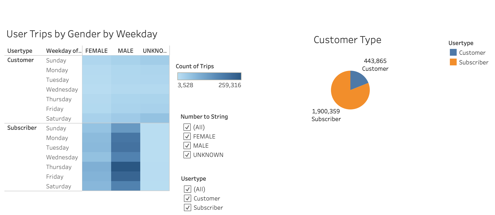
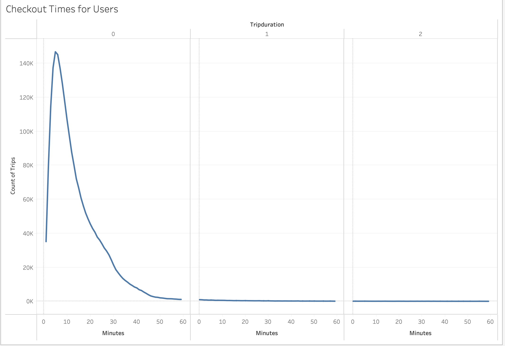
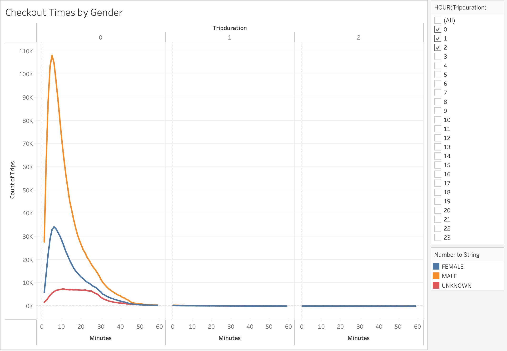
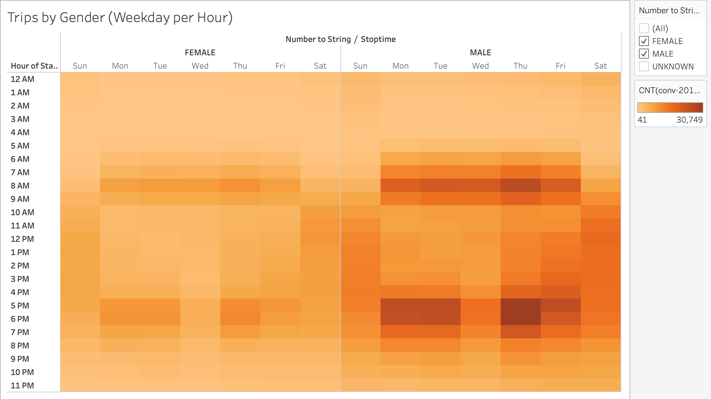

# NYC Citi Bike Challenge

## Overview
The purpose of this interactive visualization is to provide analysis on August 2019 Citi Bike ride data. A .csv file containing Citi Bike ride data was processed using Pandas in Python and then used as a data source to create a story on Tableau Public. The Tableau Public visualization can be found [here.](https://public.tableau.com/views/NYCCitiBike82019Rides/NYCCitiBikeChallenge?:language=en-US&publish=yes&:display_count=n&:origin=viz_share_link)

## Results
### Usertype
Citi Bike offers membership and one-type payment options. There were 1,900,359 rides logged by subscribed customers and 443,865 rides that were not subscribed.

- Based on the User Trips by Gender chart, men subscribed and used the service more than women. Among membership subscribers, Thursdays had the highest frequency of rides. Unknown gender rides that were also not membership users were logged more on Saturdays.

### Trip Duration
Most rides were ten minutes or less.

The breakdown by gender graph reflects this and also shows that men used the service more.

### Day of Week Usage
The Trips by Weekday Hour chart confirms that Thursdays had the most rides. Rides were higher from 7am-9am and 5pm-7pm with the evening being the peak hours. Saturdays has more ride usage throughout the entire day.

## Summary
The data demonstrates that there is demand for Citi Bike in New York City all throughout the week. Customers that are subscribed to the membership may be using the service to commute to work and for daily errands. The non-subscribers are likely visitors to the city or people that only need transport to a one-time recreational activity. An additional User type map that filters by memberships and customer would help see if there is a correlation between start location and subscribers. An additional visualization that showed age and susbscriber status might help differentiate the need for the service. Overall, this visual analysis shows that bikes placed near office spaces, hotels, and locations with high tourist traffic will lead to higher usage. The charts made can be reused to track the characteristics of customers, trip durations, and start/stop locations over time to meet the demand for efficient transportation. The Tableau Public visualization can be found [here.](https://public.tableau.com/views/NYCCitiBike82019Rides/NYCCitiBikeChallenge?:language=en-US&publish=yes&:display_count=n&:origin=viz_share_link)
